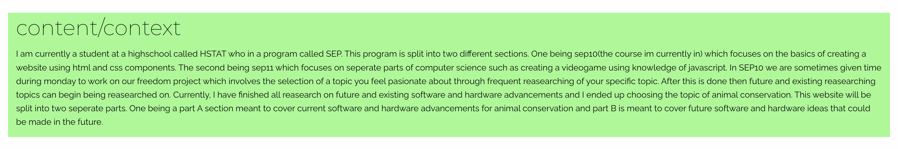
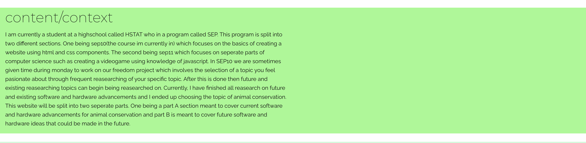

# Entry 6
##### 5/4/26

## Context
I am currently a student at a high school who is in the SEP10 program. The SEP10 program functions as a yearlong course that teaches students not only the fundamentals of creating a website using html and css. But it also teaches students important real world skills such as teamwork, facing failure, learning on your own, etc... which provide students with a better grasp of how to communicate and be more independent as well. Every day during Monday students work on a freedom project which lets students choose a topic to their liking and research it. After all that research and information, students must create a website that shows current software and hardware inventions made, and possible future hardware advancements that could be made. However, students must also pick their own **tool** which are a list of apps that can be chosen that help in improving the creation of websites without the use of so many classes. This blog entry will go over what topic and tool I had chosen, what problems/challenges I had gone through when working on my website


## Content

### Challenge One

#### Problem
I had ended up choosing the topic of animal conservation and had finished up my research, and I had ended up choosing the foundation framework as my tool. I had given myself a list of requirements in order to reach MVP status. MVP is a term in computer science that stands for minimal viable product. This means that an invention or advancement should have a complete product then go through changes in order to make it beyond a minimal product and into a more advanced final product. So, for my mvp, I decided that it would be best to first include my text/information I had gained into my website first through the inclusion of ``<p>`` ``<h1>`` and ``<br>`` tags that would set the basis for the inclusion of all other elements. However, A problem that had continued to come up was my organization of divs and placement of ``.grid-container`` and ``.grid-container-fluid`` classes. In the foundation framework, the x-y grid can be sectioned through these container classes which can keep cells organized and parts of the website polished. I included these classes when I was using a ``.cell`` class inside of multiple divs that were holding content(``<h2>`` and ``<p>`` tags), but there was an issue with how the color backgrounds were functioning. I wanted to include four background colors that would keep the website more organized to the user, but all the colors wouldn't take up the full width of the screen which would lead to a white background being shown.


Here's what the context section looked like:




#### Solution

you can see that the context section did not take up the full width of the screen and left some space in the top and bottom section. This problem however was easily fixed because it was mostly an error based on organization. I had needed to put my background class below my  ``.grid-container fluid`` class in order to get the color to fully spread out and extend. So I fixed that issue and the problem was solved right away!


here's what the context section looks like now:





code before:
```html
<div class="grid-container fluid">
   <div class="bg-color-1">
```


code after:
```html
<div class="bg-color-1">
   <div class="grid-container fluid">
```


### Challenge Two

#### Problem
I ran into a lot of problems when I started including ``.card`` classes to the website. I noticed that sometimes when the screen size of the website would change, the card classes wouldn’t be so responsive on screen sizes. I had first tried including the classes of ``grid-x`` and ``grid-margin-x`` which acted as definition types for forming grids. Then, inside of another ``<div>`` is where I would put all my content inside using a ``cell`` class that would keep each element sectioned but it didn't really work. I was able to find another solution which only required me to put  ``small-up-2`` and  ``medium-up-3`` classes in the ``grid-x`` and ``grid-margin-x`` divs. However, when I tried checking to see if the screen size was responsive all the text and cards became squished and unresponsive.


#### Solution
I checked the foundation documentation to see what was wrong with my code and the main issue was that I did not implement any ``.grid-container`` or ``.grid-container-fluid`` classes within a separate div that way so that all elements were contained in one specific container. **So**, instead of all cards being contained by a ``.grid-x`` class, all cards would be contained by ``.grid-container`` and the problem was solved!


### Challenge Three


#### Problem
Another challenge I faced with creating my website was the implementation of background colors and matching fonts. I noticed that before reaching mvp the colors often felt like they were conflicting with each other or didn't make sense as to why it was included. For example, I had added a brownish red color(``#c9533e``) to my sources section which made the links almost impossible to see because of their blue color. And for other colors that were in my website, it often conflicted with my text color which was usually black. Issues with font however were more simplistic and really only required looking for fonts that matched each other which made the process a lot more easier using **[google fonts](https://fonts.google.com/)**. But the main issue came with color combinations and contrasts.


#### Solution
I eventually found a solution that made looking for contrasting colors easier. I found a website called **[colour contrast](https://colourcontrast.cc/?background=b5efef&foreground=292c32)** which rates the contrast between a background color and foreground color(text colors). I tested out to see what was the rating of my colors which was very low, then I tried testing out the different selection of RGB colors that I could select which led to me selecting a brighter color palette for my sources section that made the website more visually appealing.


## EDP/Engineering Design Process
I am currently at stages 5-6 of the Engineering Design Process. I've been able to create and plan a draft of a website while also meeting all requirements needed( using tool components, using simple html elements and inclusion of fonts and backgrounds etc...) and now I currently need to check for any errors made in the website and make some possible improvisations on separate sections of the website if needed.


## Skills
The skills I've currently learned from creating this website were **how to google,** **debugging,** and **time management.**

* Being able to **google specific topics** became a recurring skill that I noticed I was using alot. I had a very hard time looking for different fonts and colors that could have fit the website. But by using specific searches such as **"possible color combinations"** instead of choosing "color picker" made the results that I was looking for more simple.
* Debugging was probably the most important skill by far on this project. As stated before in the content, I had struggled a lot with using the **xy grid** because the grid wasn't always so responsive on different websites. However I noticed that there were many mistakes I had made because of my implementation of different elements(divs, h1, etc...) that made my website feel buggy, but when I fixed those issues I had less to worry about and the website responsiveness problem was fixed
* The last skill that was important was time management. Because I only had a few more weeks to reach my **MVP**, I needed to be able to plan out specific dates where I would need to slowly work on adding specific components and elements to reach an MVP. This in return helped in managing not only my organization, but also in maintaining consistent **time management** that would prevent me from missing out days, or needing to rush to finish up my website.


## sources
[google fonts](https://fonts.google.com/)


[colourcontrast](https://colourcontrast.cc/?background=b5efef&foreground=292c32)


[foundation framwork](https://get.foundation/sites/docs/)


[Previous](entry05.md) | [Next](entry07.md)


[Home](../README.md)


